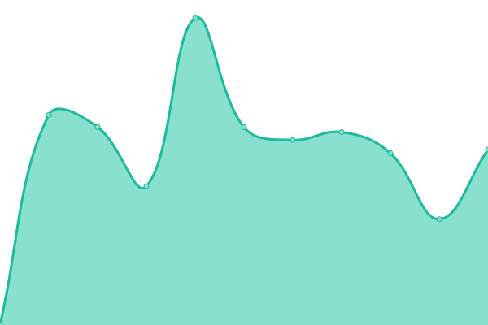
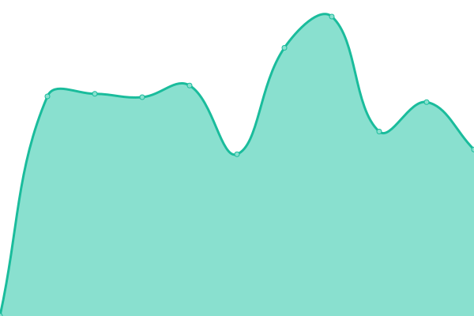
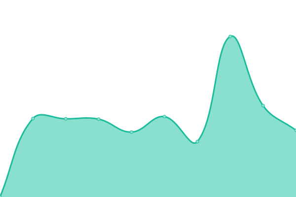
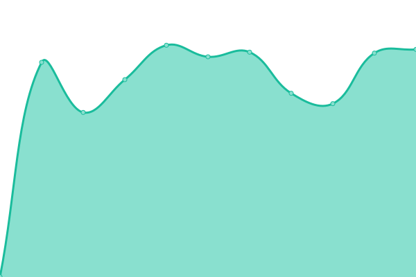

# [📈 Live Status](https://demo.upptime.js.org): <!--live status--> **🟩 All systems operational**

This repository contains the open-source uptime monitor and status page for [Upptime](https://upptime.js.org), powered by [Upptime](https://github.com/upptime/upptime).

With [Upptime](https://upptime.js.org), you can get your own unlimited and free uptime monitor and status page, powered entirely by a GitHub repository. We use [Issues](https://github.com/upptime/upptime/issues) as incident reports, [Actions](https://github.com/upptime/upptime/actions) as uptime monitors, and [Pages](https://demo.upptime.js.org) for the status page.

<!--start: status pages-->
<!-- This summary is generated by Upptime (https://github.com/upptime/upptime) -->
<!-- Do not edit this manually, your changes will be overwritten -->

| URL                                        | Status | History                                                                                            | Response Time                                                                      | Uptime                                                                                                                                                                                                                     |
| ------------------------------------------ | ------ | -------------------------------------------------------------------------------------------------- | ---------------------------------------------------------------------------------- | -------------------------------------------------------------------------------------------------------------------------------------------------------------------------------------------------------------------------- |
| [LightCyde](https://lightcyde.agency)      | 🟩 Up  | [light-cyde.yml](https://github.com/lightcyde/upptime/commits/master/history/light-cyde.yml)       |  800ms    |        |
| [Dveri Pax AT](https://dveri-pax.at)       | 🟩 Up  | [dveri-pax-at.yml](https://github.com/lightcyde/upptime/commits/master/history/dveri-pax-at.yml)   |  885ms  |    |
| [Dveri Pax SI](https://dveri-pax.si)       | 🟩 Up  | [dveri-pax-si.yml](https://github.com/lightcyde/upptime/commits/master/history/dveri-pax-si.yml)   |  1977ms |    |
| [Admonter](https://admonter.com)           | 🟩 Up  | [admonter.yml](https://github.com/lightcyde/upptime/commits/master/history/admonter.yml)           |  1137ms     |            |
| [Admonter Shop](https://shop.admonter.com) | 🟩 Up  | [admonter-shop.yml](https://github.com/lightcyde/upptime/commits/master/history/admonter-shop.yml) |  827ms |  |

<!--end: status pages-->

[**Visit our status website →**](https://demo.upptime.js.org)

## 📄 License

- Code: [MIT](./LICENSE) © [Upptime](https://upptime.js.org)
- Data in the `./history` directory: [Open Database License](https://opendatacommons.org/licenses/odbl/1-0/)
