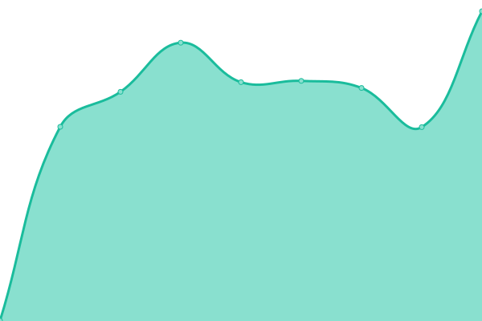
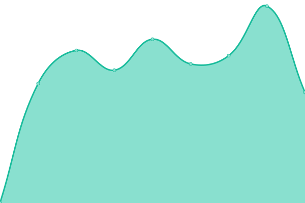
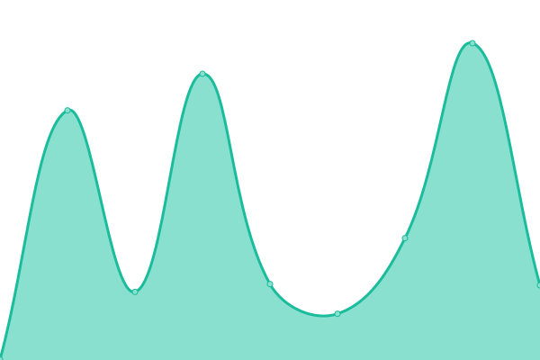

# [📈 Live Status](https://status.lightcyde.agency): <!--live status--> **🟧 Partial outage**

This repository contains the open-source uptime monitor and status page for [Upptime](https://upptime.js.org), powered by [Upptime](https://github.com/upptime/upptime).

With [Upptime](https://upptime.js.org), you can get your own unlimited and free uptime monitor and status page, powered entirely by a GitHub repository. We use [Issues](https://github.com/upptime/upptime/issues) as incident reports, [Actions](https://github.com/lightcyde/upptime/actions) as uptime monitors, and [Pages](https://demo.upptime.js.org) for the status page.

<!--start: status pages-->
<!-- This summary is generated by Upptime (https://github.com/upptime/upptime) -->
<!-- Do not edit this manually, your changes will be overwritten -->
<!-- prettier-ignore -->
| URL | Status | History | Response Time | Uptime |
| --- | ------ | ------- | ------------- | ------ |
|  [LightCyde](https://lightcyde.agency) | 🟩 Up | [light-cyde.yml](https://github.com/lightcyde/upptime/commits/HEAD/history/light-cyde.yml) | 

 357ms
     
 | 

<a href="https://status.lightcyde.agency/history/light-cyde">100.00%</a>
    

|  [Discover Culture](https://discover-culture.com) | 🟩 Up | [discover-culture.yml](https://github.com/lightcyde/upptime/commits/HEAD/history/discover-culture.yml) | 

 1557ms
     
 | 

<a href="https://status.lightcyde.agency/history/discover-culture">100.00%</a>
    

|  [Dveri Pax AT](https://dveri-pax.at) | 🟩 Up | [dveri-pax-at.yml](https://github.com/lightcyde/upptime/commits/HEAD/history/dveri-pax-at.yml) | 

 1018ms
     
 | 

<a href="https://status.lightcyde.agency/history/dveri-pax-at">100.00%</a>
    

|  [Dveri Pax SI](https://dveri-pax.si) | 🟩 Up | [dveri-pax-si.yml](https://github.com/lightcyde/upptime/commits/HEAD/history/dveri-pax-si.yml) | 

 765ms
     
 | 

<a href="https://status.lightcyde.agency/history/dveri-pax-si">100.00%</a>
    

|  [Dveri Pax DE](https://dveri-pax.de) | 🟩 Up | [dveri-pax-de.yml](https://github.com/lightcyde/upptime/commits/HEAD/history/dveri-pax-de.yml) | 

 790ms
     
 | 

<a href="https://status.lightcyde.agency/history/dveri-pax-de">100.00%</a>
    

|  [Admonter Shop](https://shop.admonter.com) | 🟩 Up | [admonter-shop.yml](https://github.com/lightcyde/upptime/commits/HEAD/history/admonter-shop.yml) | 

 1015ms
     
 | 

<a href="https://status.lightcyde.agency/history/admonter-shop">100.00%</a>
    

|  [Mission Austria](https://mission-austria.at) | 🟩 Up | [mission-austria.yml](https://github.com/lightcyde/upptime/commits/HEAD/history/mission-austria.yml) | 

 329ms
     
 | 

<a href="https://status.lightcyde.agency/history/mission-austria">100.00%</a>
    

|  [Gesäuse Betriebe](https://betriebe.gesaeuse.at) | 🟩 Up | [gesaeuse-betriebe.yml](https://github.com/lightcyde/upptime/commits/HEAD/history/gesaeuse-betriebe.yml) | 

 592ms
     
 | 

<a href="https://status.lightcyde.agency/history/gesaeuse-betriebe">100.00%</a>
    

|  [ConstantlyK Shop](https://cyk-shop.com) | 🟩 Up | [constantly-k-shop.yml](https://github.com/lightcyde/upptime/commits/HEAD/history/constantly-k-shop.yml) | 

 703ms
     
 | 

<a href="https://status.lightcyde.agency/history/constantly-k-shop">100.00%</a>
    

|  [Nationalpark Gesäuse](https://nationalpark-gesaeuse.at) | 🟩 Up | [nationalpark-gesaeuse.yml](https://github.com/lightcyde/upptime/commits/HEAD/history/nationalpark-gesaeuse.yml) | 

 581ms
     
 | 

<a href="https://status.lightcyde.agency/history/nationalpark-gesaeuse">100.00%</a>
    

|  [STIA Immo](https://stiaimmo.at) | 🟥 Down | [stia-immo.yml](https://github.com/lightcyde/upptime/commits/HEAD/history/stia-immo.yml) | 

 503ms
     
 | 

<a href="https://status.lightcyde.agency/history/stia-immo">100.00%</a>
    

|  [Stift Admont](https://stiftadmont.at) | 🟩 Up | [stift-admont.yml](https://github.com/lightcyde/upptime/commits/HEAD/history/stift-admont.yml) | 

 687ms
     
 | 

<a href="https://status.lightcyde.agency/history/stift-admont">100.00%</a>
    

|  [Warda](https://warda.at) | 🟩 Up | [warda.yml](https://github.com/lightcyde/upptime/commits/HEAD/history/warda.yml) | 

 254ms
     
 | 

<a href="https://status.lightcyde.agency/history/warda">100.00%</a>
    

|  [RML](https://region-liezen.at) | 🟩 Up | [rml.yml](https://github.com/lightcyde/upptime/commits/HEAD/history/rml.yml) | 

 958ms
     
 | 

<a href="https://status.lightcyde.agency/history/rml">100.00%</a>
    

|  [S3 FTP Server](167.235.62.202) | 🟩 Up | [s3-ftp-server.yml](https://github.com/lightcyde/upptime/commits/HEAD/history/s3-ftp-server.yml) | 

 112ms
     
 | 

<a href="https://status.lightcyde.agency/history/s3-ftp-server">100.00%</a>
    

<!--end: status pages-->

[**Visit our status website →**](https://status.lightcyde.agency)

## 📄 License

- Code: [MIT](./LICENSE) © [Upptime](https://upptime.js.org)
- Data in the `./history` directory: [Open Database License](https://opendatacommons.org/licenses/odbl/1-0/)
