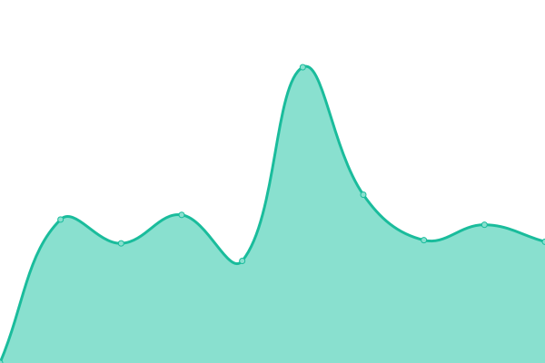

# [📈 Live Status](https://status.lightcyde.agency): <!--live status--> **🟩 All systems operational**

This repository contains the open-source uptime monitor and status page for [Upptime](https://upptime.js.org), powered by [Upptime](https://github.com/upptime/upptime).

With [Upptime](https://upptime.js.org), you can get your own unlimited and free uptime monitor and status page, powered entirely by a GitHub repository. We use [Issues](https://github.com/upptime/upptime/issues) as incident reports, [Actions](https://github.com/upptime/upptime/actions) as uptime monitors, and [Pages](https://demo.upptime.js.org) for the status page.

<!--start: status pages-->
<!-- This summary is generated by Upptime (https://github.com/upptime/upptime) -->
<!-- Do not edit this manually, your changes will be overwritten -->
<!-- prettier-ignore -->
| URL | Status | History | Response Time | Uptime |
| --- | ------ | ------- | ------------- | ------ |
| [LightCyde](https://lightcyde.agency) | 🟩 Up | [light-cyde.yml](https://github.com/lightcyde/upptime/commits/master/history/light-cyde.yml) | 

 899ms
     
 | 

   

| [Cultour](https://cultour.digital) | 🟩 Up | [cultour.yml](https://github.com/lightcyde/upptime/commits/master/history/cultour.yml) | 

 969ms
     
 | 

   

| [Dveri Pax AT](https://dveri-pax.at) | 🟩 Up | [dveri-pax-at.yml](https://github.com/lightcyde/upptime/commits/master/history/dveri-pax-at.yml) | 

 1063ms
     
 | 

   

| [Dveri Pax SI](https://dveri-pax.si) | 🟩 Up | [dveri-pax-si.yml](https://github.com/lightcyde/upptime/commits/master/history/dveri-pax-si.yml) | 

 1066ms
     
 | 

   

| [Admonter](https://admonter.com) | 🟩 Up | [admonter.yml](https://github.com/lightcyde/upptime/commits/master/history/admonter.yml) | 

 1011ms
     
 | 

   

| [Admonter Shop](https://shop.admonter.com) | 🟩 Up | [admonter-shop.yml](https://github.com/lightcyde/upptime/commits/master/history/admonter-shop.yml) | 

 869ms
     
 | 

   

| [Mission Austria](https://mission-austria.at) | 🟩 Up | [mission-austria.yml](https://github.com/lightcyde/upptime/commits/master/history/mission-austria.yml) | 

 1304ms
     
 | 

   

| [Gesäuse](https://gesaeuse.at) | 🟩 Up | [gesaeuse.yml](https://github.com/lightcyde/upptime/commits/master/history/gesaeuse.yml) | 

 3679ms
     
 | 

   

| [Gesäuse Partner](https://partner.gesaeuse.at) | 🟩 Up | [gesaeuse-partner.yml](https://github.com/lightcyde/upptime/commits/master/history/gesaeuse-partner.yml) | 

 1922ms
     
 | 

   

<!--end: status pages-->

[**Visit our status website →**](https://status.lightcyde.agency)

## 📄 License

- Code: [MIT](./LICENSE) © [Upptime](https://upptime.js.org)
- Data in the `./history` directory: [Open Database License](https://opendatacommons.org/licenses/odbl/1-0/)
