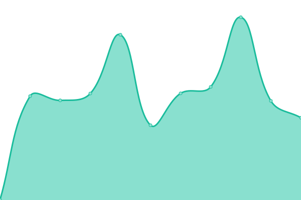
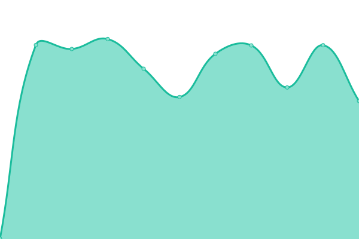
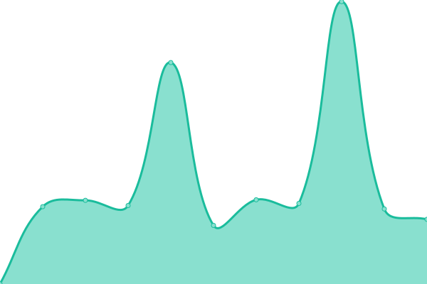

# [📈 Live Status](https://status.lightcyde.agency): <!--live status--> **🟩 All systems operational**

This repository contains the open-source uptime monitor and status page for [Upptime](https://upptime.js.org), powered by [Upptime](https://github.com/upptime/upptime).

With [Upptime](https://upptime.js.org), you can get your own unlimited and free uptime monitor and status page, powered entirely by a GitHub repository. We use [Issues](https://github.com/upptime/upptime/issues) as incident reports, [Actions](https://github.com/upptime/upptime/actions) as uptime monitors, and [Pages](https://demo.upptime.js.org) for the status page.

<!--start: status pages-->
<!-- This summary is generated by Upptime (https://github.com/upptime/upptime) -->
<!-- Do not edit this manually, your changes will be overwritten -->

| URL                                            | Status | History                                                                                                  | Response Time                                                                          | Uptime                                                                                                                                                                                                                           |
| ---------------------------------------------- | ------ | -------------------------------------------------------------------------------------------------------- | -------------------------------------------------------------------------------------- | -------------------------------------------------------------------------------------------------------------------------------------------------------------------------------------------------------------------------------- |
| [LightCyde](https://lightcyde.agency)          | 🟩 Up  | [light-cyde.yml](https://github.com/lightcyde/upptime/commits/master/history/light-cyde.yml)             |  867ms        |              |
| [Cultour](https://cultour.digital)             | 🟩 Up  | [cultour.yml](https://github.com/lightcyde/upptime/commits/master/history/cultour.yml)                   |  1000ms          |                    |
| [Dveri Pax AT](https://dveri-pax.at)           | 🟩 Up  | [dveri-pax-at.yml](https://github.com/lightcyde/upptime/commits/master/history/dveri-pax-at.yml)         |  1081ms     |          |
| [Dveri Pax SI](https://dveri-pax.si)           | 🟩 Up  | [dveri-pax-si.yml](https://github.com/lightcyde/upptime/commits/master/history/dveri-pax-si.yml)         |  1036ms     |           |
| [Admonter](https://admonter.com)               | 🟩 Up  | [admonter.yml](https://github.com/lightcyde/upptime/commits/master/history/admonter.yml)                 |  1024ms         |                  |
| [Admonter Shop](https://shop.admonter.com)     | 🟩 Up  | [admonter-shop.yml](https://github.com/lightcyde/upptime/commits/master/history/admonter-shop.yml)       |  881ms     |        |
| [Mission Austria](https://mission-austria.at)  | 🟩 Up  | [mission-austria.yml](https://github.com/lightcyde/upptime/commits/master/history/mission-austria.yml)   |  1241ms  |    |
| [Gesäuse](https://gesaeuse.at)                 | 🟩 Up  | [gesaeuse.yml](https://github.com/lightcyde/upptime/commits/master/history/gesaeuse.yml)                 |  3692ms         |                  |
| [Gesäuse Partner](https://partner.gesaeuse.at) | 🟩 Up  | [gesaeuse-partner.yml](https://github.com/lightcyde/upptime/commits/master/history/gesaeuse-partner.yml) |  1648ms |  |

<!--end: status pages-->

[**Visit our status website →**](https://status.lightcyde.agency)

## 📄 License

- Code: [MIT](./LICENSE) © [Upptime](https://upptime.js.org)
- Data in the `./history` directory: [Open Database License](https://opendatacommons.org/licenses/odbl/1-0/)
